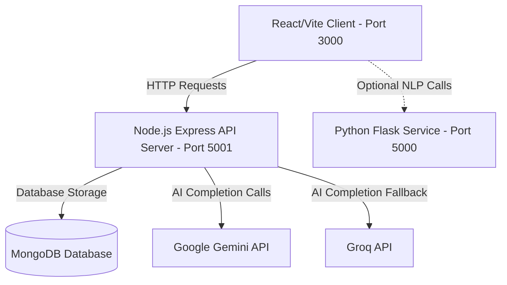

# ATSify.ai — AI Resume Analyzer & ATS Optimizer

Welcome to **ATSify.ai**, an elite, production-grade AI-powered resume analyzer, scoring engine, and ATS optimizer. The platform allows users to upload their resumes (in PDF or DOCX format) and receive standalone ATS readability scores, formatting analyses, section-by-section optimizations, and professional rewrites powered by Google Gemini and Groq AI models.

---

## 🏗️ Project Architecture

The application is structured as a modern decoupled full-stack architecture consisting of three main components:



### 1. Frontend Client (`/client`)
- **Technology Stack**: React 19, Vite, TailwindCSS (for sleek, premium layouts), Framer Motion (for dynamic UI animations), Lucide React (for premium icons).
- **Core Role**: Manages the upload payload selection, triggers authentication, displays beautiful visual score circles (ATS Index), presents section-by-section before/after comparisons, and hosts a custom rich-text editor for direct PDF resume generation.

### 2. Backend API Server (`/server`)
- **Technology Stack**: Node.js, Express, Mongoose, Passport (OAuth for Google/LinkedIn), Puppeteer (for server-side PDF conversion).
- **Core Role**: Handles user authentication, session state, secure resume file uploading (via Multer), text extraction (via Mammoth & pdf-parse), Gemini & Groq AI orchestration, and deterministic scoring.

### 3. Optional NLP Service (`/backend`)
- **Technology Stack**: Python, Flask, pdfplumber, python-docx.
- **Core Role**: Contains standard regex/NLP pipeline parsing tools (`ats_scorer.py`, `extractor.py`, `jd_matcher.py`) to run local scoring evaluations.

---

## 🌟 Key Features

1. **Standalone Resume Scoring**: Evaluates the resume standalone against professional standards. It grades format density, action verb usage, missing headers (email, phone, LinkedIn), and section completeness.
2. **Dynamic AI Analysis**: Leverages Gemini 3.5 and Groq to scan resume blocks and generate a structured optimization checklist without requiring specific target roles.
3. **Interactive Section Optimizer**: Displays a side-by-side comparison of original text vs. AI-optimized versions (e.g., rewriting bullet points to lead with action verbs and include metrics).
4. **AI Resume Fixer**: Generates an optimized, download-ready resume draft based on parsed parameters.
5. **PDF Resume Builder & Exporter**: Offers pre-built templates and a server-side PDF compiler powered by Puppeteer.

---

## ⚙️ Configuration & API Setup

Before running the project, set up the configuration keys in both the client and server.

### 1. Server Environment Setup (`/server/.env`)
Create a `.env` file in the `/server` directory (you can copy `/server/.env.example` as a template) and configure the following keys:

```env
# Google OAuth Credentials (for Google Login to work)
GOOGLE_CLIENT_ID=your_google_client_id
GOOGLE_CLIENT_SECRET=your_google_client_secret
GOOGLE_API_KEY=your_google_gemini_api_key

# LinkedIn OAuth Credentials (optional)
LINKEDIN_CLIENT_ID=your_linkedin_client_id
LINKEDIN_CLIENT_SECRET=your_linkedin_client_secret

# MongoDB (Local instance or Mongo Atlas Cloud)
MONGO_URI=mongodb+srv://<username>:<password>@cluster.mongodb.net/database_name

# App Settings
JWT_SECRET=your_jwt_signing_secret_key
PORT=5001

# Allowed client URL for CORS
CLIENT_URL=http://localhost:3000

# Payment Gateway (Razorpay keys)
RAZORPAY_KEY_ID=your_razorpay_key_id
RAZORPAY_KEY_SECRET=your_razorpay_key_secret

# Groq API Credentials (alternative fallback model)
GROQ_API_KEY=your_groq_api_key
```

### 2. Client Environment Setup (`/client/.env`)
Create a `.env` file in the `/client` directory (you can copy `/client/.env.example` as a template) and configure:

```env
VITE_API_BASE_URL=http://localhost:5001
VITE_AI_API_URL=http://localhost:5000
```

---

## 🚀 Step-by-Step Run Instructions (From Zip File)

Follow these instructions to start the project from a fresh zip file extract:

### 1. Extract the Zip File
Unzip the project archive and open your terminal (e.g., Command Prompt, Git Bash, or VS Code terminal) in the extracted directory.

### 2. Start the Backend API Server
1. Navigate to the server folder:
   ```bash
   cd server
   ```
2. Install dependencies:
   ```bash
   npm install
   ```
3. Set up your `.env` file with your database URI and API keys.
4. Run the backend server in development mode:
   ```bash
   npm start
   ```
   *Note: If script execution is blocked on Windows PowerShell, run the command using Command Prompt:*
   ```bash
   cmd /c npm start
   ```
   The backend will start and display: `http://localhost:5001 🚀` and `MongoDB connected ✅`.

### 3. Start the Frontend React Client
1. Open a new terminal tab/window and navigate to the client folder:
   ```bash
   cd client
   ```
2. Install dependencies:
   ```bash
   npm install
   ```
3. Run the development server:
   ```bash
   npm run dev
   ```
   *(Or on Windows if scripts are blocked: `cmd /c npm run dev`)*
4. The application will compile and start running on [http://localhost:3000](http://localhost:3000). It will automatically open in your default web browser.

---

## 🛠️ Developer Hand-off Notes (For the Next Engineer)

### Codebase Directory Layout

```
Resume_Analyzer-main/
├── client/                     # React / Vite SPA Client
│   ├── src/
│   │   ├── features/           # Modularized feature folders
│   │   │   ├── auth/           # OAuth, login, sign-up views
│   │   │   ├── dashboard/      # Dashboards, history tracking, editor
│   │   │   └── resume-analyzer/# Standalone resume analysis pages & UI
│   │   └── components/         # Global reusable UI design elements
├── server/                     # Express Node.js Server
│   ├── routes/                 # API Route endpoints
│   ├── controllers/            # Controller business logic
│   ├── services/               # DB and PDF compilation services
│   ├── utils/                  # Gemini, atsScorer, & parser utilities
│   └── models/                 # MongoDB Mongoose Schemas
└── backend/                    # Python Flask NLP Pipeline (Optional)
```

### Standalone Scoring Architecture

In the latest design update, **target job descriptions and specific roles have been decoupled** from the core resume parsing engine:
- The input boxes for "Target Job Role" and "Target Position" have been removed from both the dashboard screen (`ResumeFeedback.jsx`) and standalone page (`ResumeAnalyzer.jsx`).
- The client calls the backend endpoints (`/api/resume/analyze` or `/api/ai-resume/analyze`) sending empty strings for `role` and `jobDescription`.
- The backend prompts in `server/utils/gemini.js` and `server/services/resumeService.js` handle these empty values dynamically. If no role is specified, they omit the JD instructions and direct the LLM model to score and analyze the resume solely based on its layout structure, standard heading completeness, verb strength, formatting issues, and readability indices.
- Local deterministic scoring fallbacks in `server/utils/atsScorer.js` automatically adapt: if `jdKeywords` is empty, it bypasses the matching loops and computes a score based on formatting consistency, skills count, experience dates, action verbs, and text length benchmarks.
